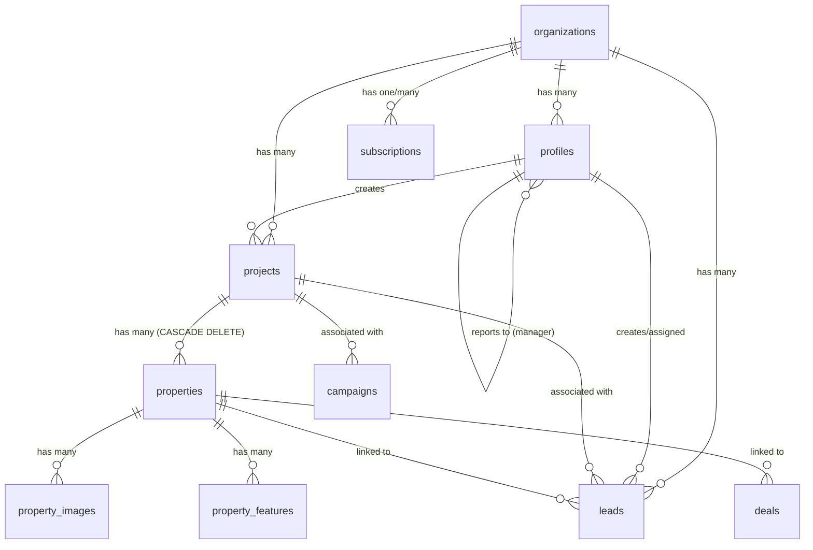
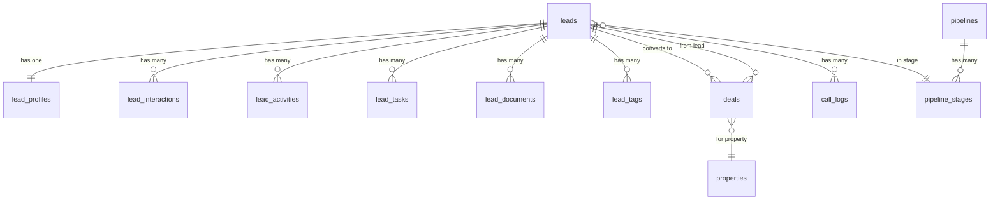
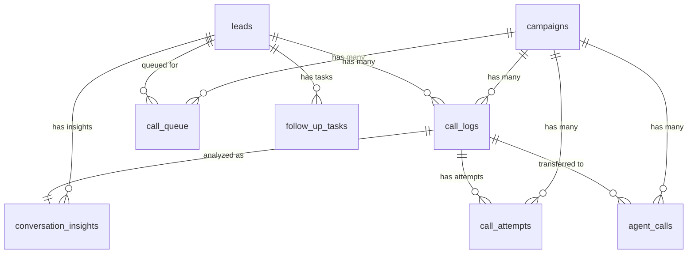
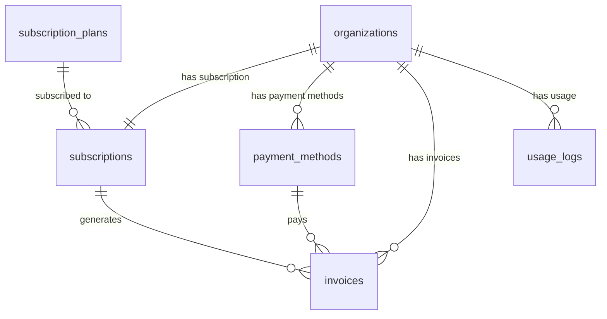
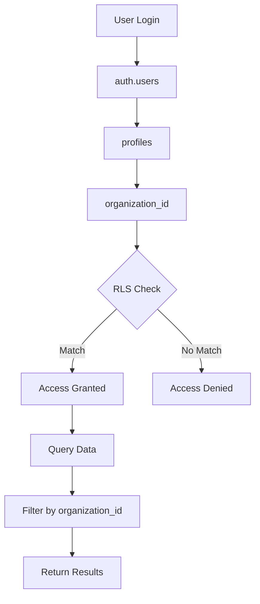
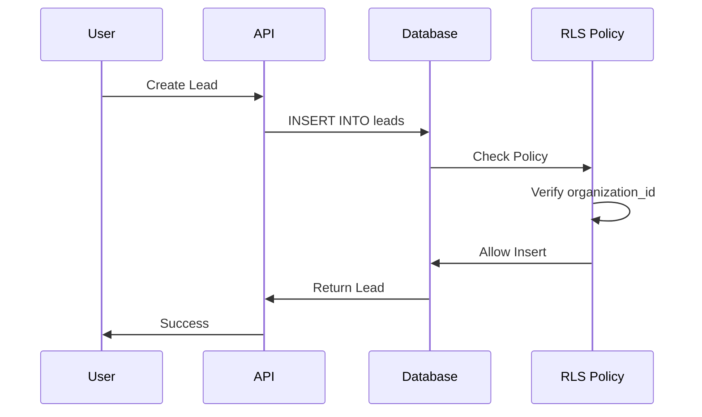
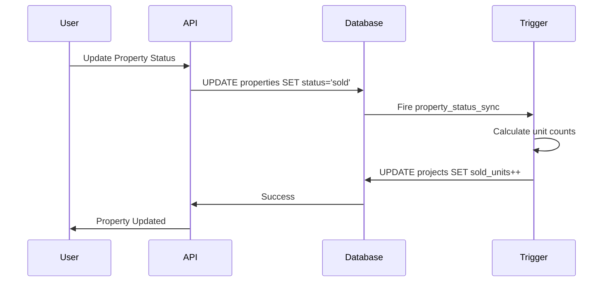

# Entity Relationships

## Core Relationships

## CRM Relationships

## Calling Relationships

## Billing Relationships

## Key Foreign Key Constraints

### CASCADE DELETE

| Parent Table | Child Table | Column | Behavior |
|--------------|-------------|--------|----------|
| `projects` | `properties` | `project_id` | **CASCADE DELETE** |

> [!IMPORTANT]
> When a project is deleted, all its properties are automatically deleted.

### SET NULL

| Parent Table | Child Table | Column | Behavior |
|--------------|-------------|--------|----------|
| `profiles` | `leads` | `assigned_to` | SET NULL |
| `properties` | `leads` | `property_id` | SET NULL |

### RESTRICT (Default)

Most other foreign keys use RESTRICT, preventing deletion if referenced records exist.

## Multi-Tenant Architecture

## Data Flow Examples

### Creating a Lead

### Property Status Change

## Important Notes

> [!WARNING]
>
> - Always use `organization_id` for multi-tenant queries
> - CASCADE DELETE on `properties` means deleting a project deletes all units
> - Lead scoring is automatically updated via triggers

> [!TIP]
>
> - Use admin client to avoid RLS recursion
> - Check foreign key constraints before bulk deletions
> - Monitor trigger performance on large datasets
