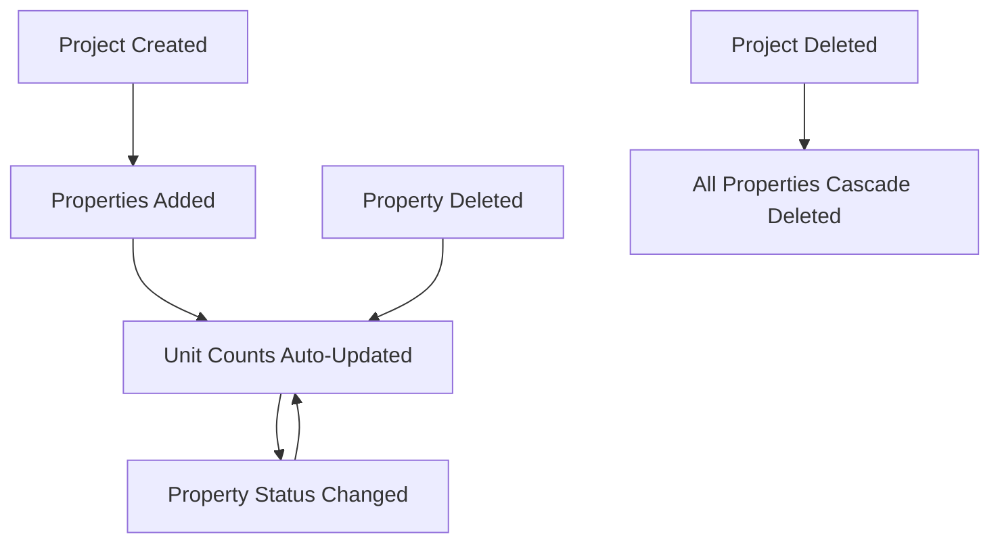

# Inventory Tables

## properties

**Purpose**: Individual units/properties within projects (apartments, plots, commercial spaces).

### Key Columns

- `id`, `organization_id`, `project_id` (FK → projects, **CASCADE DELETE**)
- `title`, `description`, `address`
- `price`, `size_sqft`, `bedrooms`, `bathrooms`
- `type` (apartment, villa, plot, commercial, etc.)
- `status` (available, reserved, sold)
- `show_in_crm` (visibility flag)
- `created_by`

### Relationships

- **Belongs to**: `projects` (CASCADE DELETE on project deletion)
- **Has many**: `property_images`, `property_features`
- **Referenced by**: `leads.property_id`, `deals.property_id`

### RLS Policies

- `view_org_properties`, `manage_org_properties`

### Triggers

- `property_status_sync`: Syncs project unit counts on INSERT/UPDATE
- `property_delete_sync`: Syncs project unit counts on DELETE

### Notes

> [!IMPORTANT]
>
> - When a project is deleted, all properties are automatically deleted (CASCADE)
> - Property status changes automatically update parent project's unit counts
> - Use `show_in_crm` to control visibility in CRM module

---

## property_images

**Purpose**: Image gallery for properties.

### Key Columns

- `property_id` (FK → properties)
- `url`, `is_featured`, `order_index`

---

## property_features

**Purpose**: Features/amenities for properties (parking, gym, pool, etc.).

### Key Columns

- `property_id` (FK → properties)
- `feature_name`

---

## Summary

The Inventory module provides:

- **Property Management**: Individual unit tracking
- **Status Management**: Available, reserved, sold tracking
- **Auto-sync**: Project unit counts automatically updated
- **Media Management**: Image galleries
- **Feature Tracking**: Amenities and features

### Inventory Flow

### Important Constraints

- **CASCADE DELETE**: Deleting a project deletes all its properties
- **Auto-sync**: Property changes trigger project unit count updates
- **Organization Isolation**: RLS ensures users only see their org's properties
