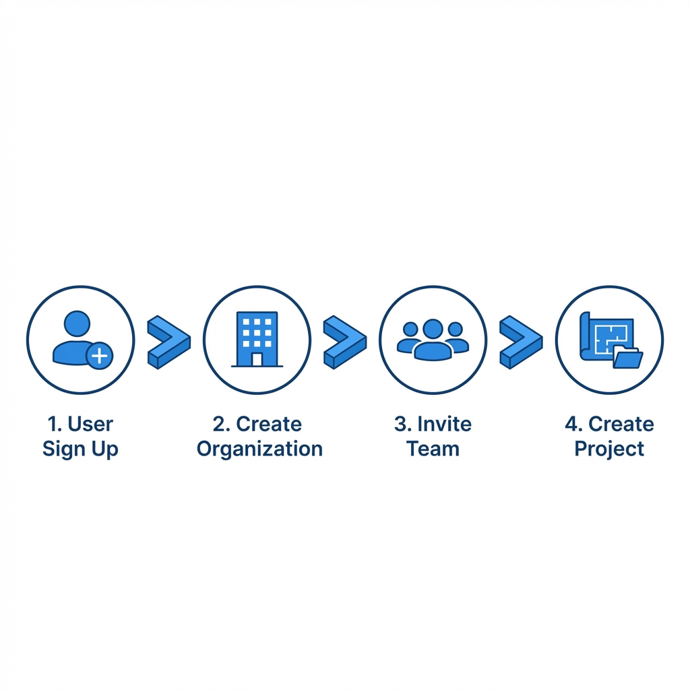
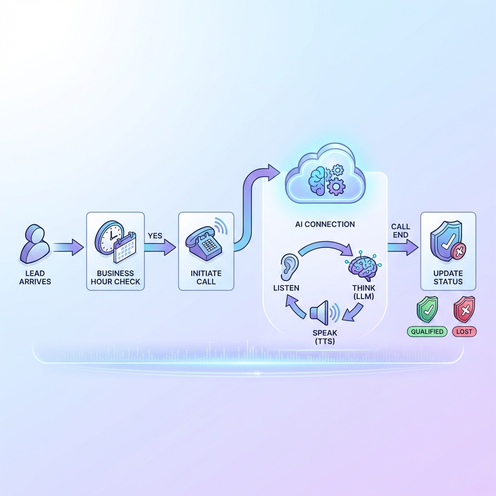
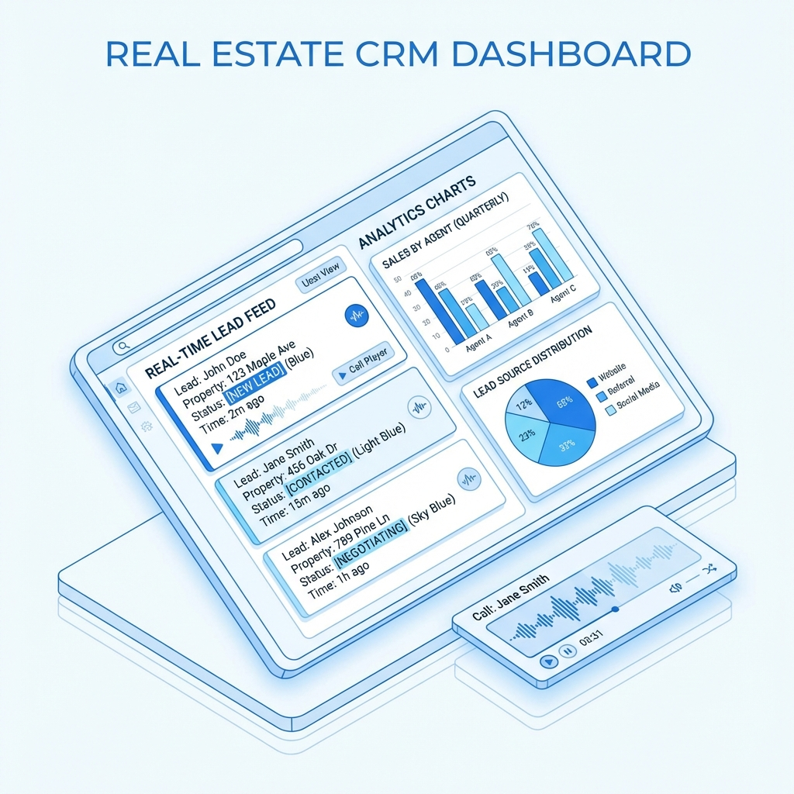
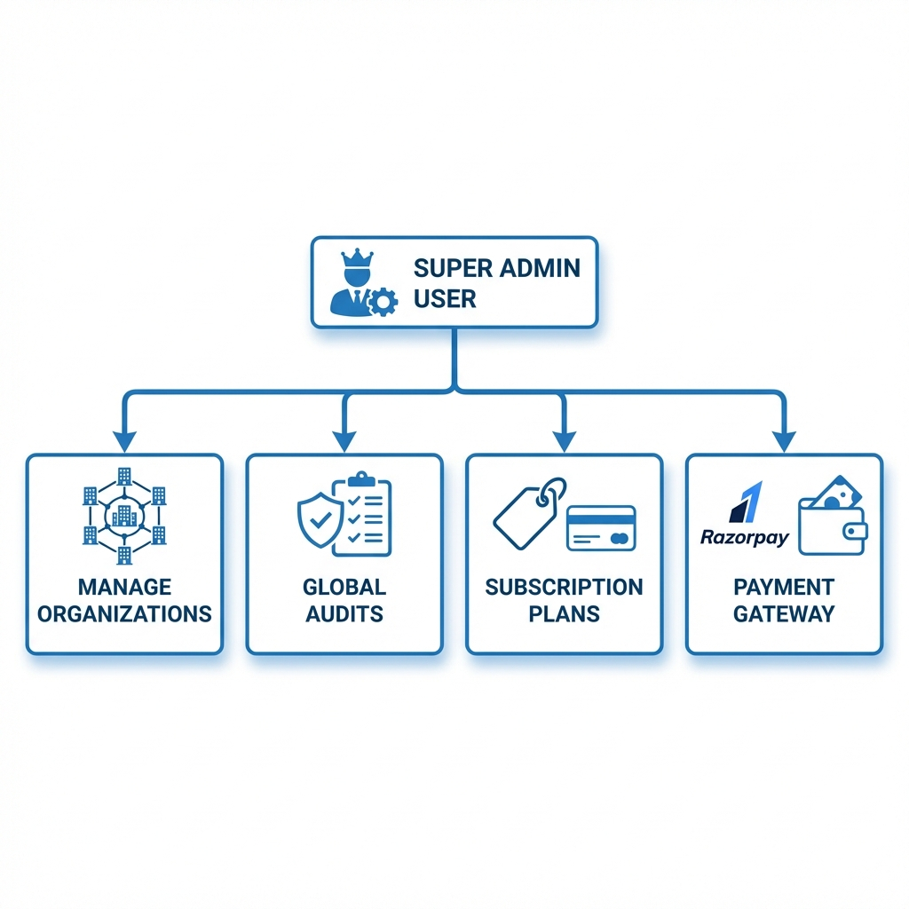
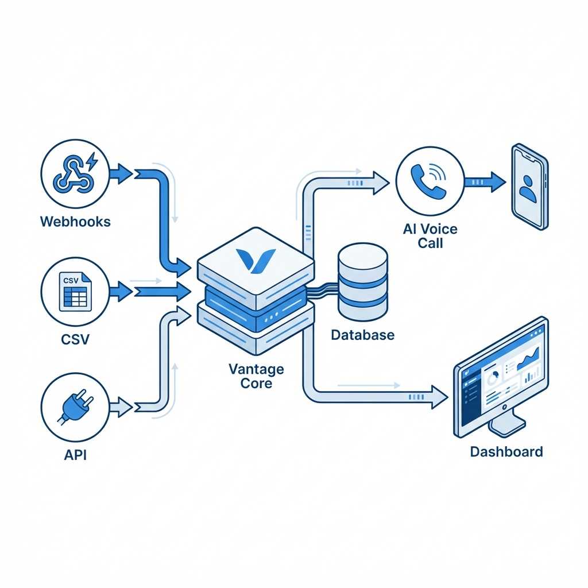

# Vantage AI - End-to-End User Flow

This document outlines the complete user journey within the **Vantage AI** platform, from onboarding to automated lead qualification.

## 1. System Overview

**Vantage** is an AI-powered voice CRM designed for real estate. It automates the "first mile" of lead qualification by instantly calling new leads, qualifying them using a human-like AI persona ("Riya"), and syncing the data back to your dashboard.

---

## 2. The User Journey

### Phase 1: Onboarding & Organization Setup

1. **New User Sign Up**:
    * User creates an account using email/password.
    * **Action**: `Auth -> Sign Up`

2. **Organization Creation**:
    * Upon first login, the user creates an Organization (e.g., "Prestige Realty").
    * **Role**: The creator becomes the **Owner** of the organization.

3. **Team Management**:
    * Owner can invite team members via email.
    * Roles: `Owner`, `Admin`, `Member` (View Access).



### Phase 2: Campaign & Project Setup

Before receiving leads, the AI needs to know *what* it is selling.

1. **Create a Project**:
    * Navigate to `Campaigns/Projects`.
    * Add details: Project Name (e.g., "Sunrise Apartments"), Location, Price Range, Configuration (2BHK/3BHK).
    * **Purpose**: This metadata feeds into the AI's context so "Riya" can answer questions accurately.

2. **Configure AI Persona**:
    * The system uses a default persona "Riya" (Senior Sales Executive).
    * She is polite, professional, and optimized for a 90-second qualification call.

### Phase 3: Lead Ingestion (The Input)

There are three ways to feed leads into Vantage:

1. **Real-time Integrations (Webhooks)**:
    * Navigate to `Settings -> Integrations`.
    * Connect sources like **MagicBricks**, **99acres**, or **Facebook Ads**.
    * Copy the provided Webhook URL and paste it into the respective portal's backend.
    * *Result*: Leads flow in automatically the moment a customer enquires.

2. **Bulk CSV Upload**:
    * Navigate to `Leads -> Upload`.
    * Upload a CSV file containing `Name`, `Phone`, and `Project`.
    * *Result*: System queues calls for all valid rows.

3. **API Ingestion**:
    * Developers can POST directly to `/api/leads/ingest`.


### Phase 4: Automated AI Qualification (The Core)

Once a lead enters the system:

1. **Normalization & Validation**:
    * System cleans the phone number (+91 format) and checks for duplicates.
    * Validates the assigned `Project ID`.

2. **Call Trigger**:
    * If within business hours, the system initiates an outbound call via Plivo/Twilio.

3. **The Conversation**:
    * **Riya** introduces herself as calling from the specific project.
    * **Discovery**: Asks about requirements (Budget, Configuration, Timeline).
    * **Handling**: Answers questions about the project using the metadata.
    * **Closing**: Attempts to schedule a site visit or flags the lead as "Not Interested".

4. **Disconnection Handling**:
    * Handles scenarios like Busy, No Answer, or "Wrong Number" automatically.



### Phase 5: Dashboard & Analytics (The Output)

1. **Live Feed**:
    * Admins watch the `Dashboard` for real-time updates.
    * Status changes: `New` -> `Contacted` -> `Qualified` / `Not Interested`.

2. **Call Audits**:
    * Navigate to specific lead details.
    * **Listen**: Play back the full audio recording.
    * **Read**: View the transcript and AI-generated summary.

3. **Analytics**:
    * View metrics: Total Calls, Qualification Rate, Average Call Duration.



### Phase 6: Billing & Subscription

1. **Subscription**:
    * Users subscribe to plans (Starter/Pro/Enterprise) via Razorpay.
    * Plans dictate the feature set and base call limits.

2. **Credits & Usage**:
    * System tracks "AI Minutes" used.
    * Admins can view usage limits in `Settings -> Billing`.
    * Top-up credits if limits are reached.

### Phase 7: Platform Administration

1. **Overview**:
    * Super Admins manage the entire ecosystem.
    * **Capabilities**: Create Organizations, Manage Plans, View Global Audits.



---

## 3. Visual Workflow

### System Dataflow Diagram



### Logic Flow (Mermaid)

```mermaid
graph TD
    User([User / Admin]) -->|1. Setup| Org[Create Org & Project]
    Org -->|2. Connect| Integrations[Integrations (FB, 99Acres)]
    
    LeadSource[Lead Sources] -->|Webhook/CSV| Ingest[Lead Ingestion API]
    Ingest -->|Validate| DB[(Database)]
    
    DB -->|Trigger| AICall[AI Call Dispatcher]
    AICall -->|Voice Stream| Customer([Customer])
    
    subgraph "AI Interaction"
        Customer <-->|Real-time Audio| Riya[AI Persona (Riya)]
        Riya -->|Context| ProjectMeta[Project Metadata]
    end
    
    Riya -->|Post Call| Update[Update Lead Status]
    Update -->|Summary/Recording| Dashboard[Admin Dashboard]
    
    User -->|monitor| Dashboard
```

## 4. Error Handling & Support

* **Ingestion Errors**: If a CSV upload fails (e.g., missing phone), the system provides a detailed error report with row numbers and hints.
* **Call Failures**: Failed calls are retried or marked as `Failed` for manual review.
* **Support**: Critical issues trigger alerts to the Platform Admin.
