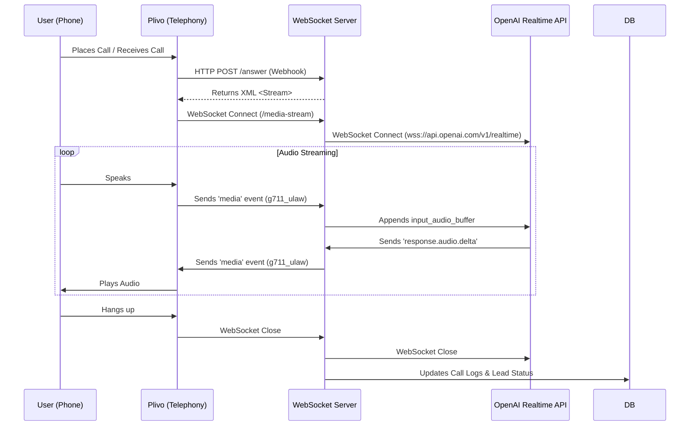

# WebSocket Call Flow

## Overview

This document describes the real-time communication flow between Plivo (telephony), the WebSocket Server, and OpenAI (AI Intelligence).

## Architecture

## Key Components

### 1. `sessionUpdate.js` (Session Configuration)

Configures the AI persona and behavior at the start of the session.

- **Voice**: 'shimmer' (Female)
- **Instructions**: System prompt defining the AI's role and rules.
- **VAD Settings**:
  - Threshold: 0.7 (Ignores background noise)
  - Silence Duration: 800ms (Prevents cutting off)

### 2. `index.js` (Server Logic)

Handles the WebSocket events and orchestrates the flow.

#### Events Handled

- **`media`**: Audio chunk from Plivo -> Sent to OpenAI.
- **`response.audio.delta`**: Audio chunk from OpenAI -> Sent to Plivo.
- **`response.audio.done`**: Response completed.
- **`input_audio_buffer.speech_started`**: User started speaking (Interrupt handling).
  -**Action**: Sends `response.cancel` to OpenAI to stop generating.
  -**Action**: Clears Plivo audio buffer.

### 3. Function Calling (Tool Use)

The AI works with a `transfer_call` tool definition.

- **Trigger**: User asks to speak to a human.
- **Flow**:
  1. OpenAI sends `function_call` event.
  2. Server verifies `transfer_call`.
  3. Server updates DB (`transferred`, `call_status`).
  4. Server instructs Plivo to transfer (or mock transfer).

## Database Updates

### On Call Start

- detailed `call_log` created with `status='called'`.

### On Transfer

- `call_logs` updated: `transferred=true`, `transfer_reason`.
- `leads` updated: `call_status='transferred'`, `transferred_to_human=true`.

### On Call End

- `call_logs` updated: `duration`, `transcript`, `summary`.
- `leads` updated: `call_status='called'` (if not transferred).

## Debugging

- **Logs**: The server logs every step with emojis (🚀, 🎤, 🔊).
- **Console**: Check the terminal running `npm run dev` for real-time logs.
- **Plivo Logs**: Check Plivo dashboard for disconnect reasons.
